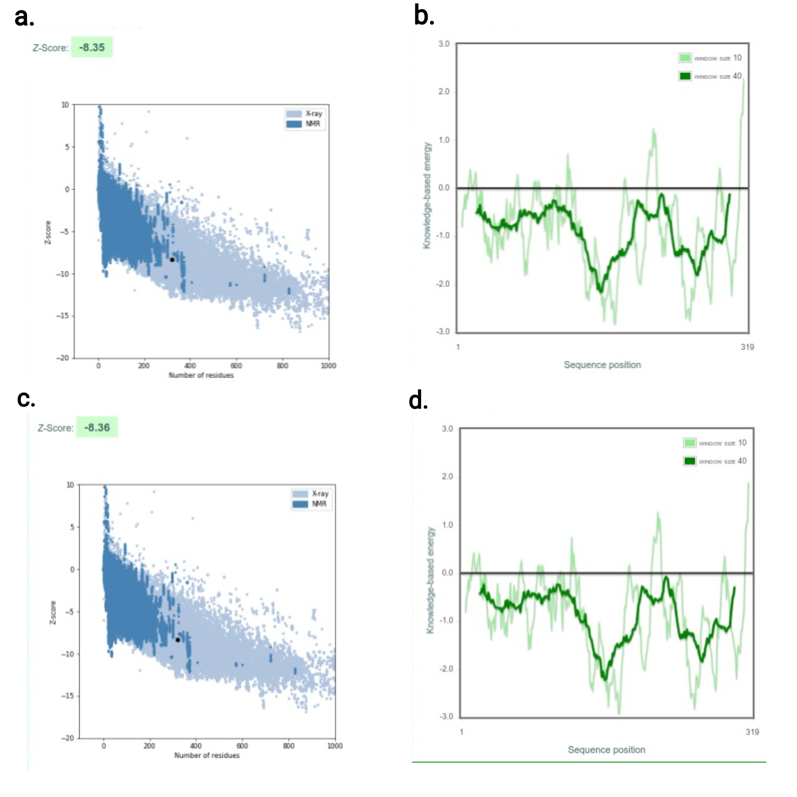

# Análisis comparativo estructural de proteínas
- José Antonio Sánchez Villicaña
- Bernardo Chombo Álvarez

## Introducción
La comparación de estructuras de proteínas juega un papel fundamental en la
comprensión de la función, evolución y relaciones entre las proteínas. Al
examinar el arreglo tridimensional de átomos dentro de una proteína, los
científicos pueden obtener información sobre su actividad bioquímica,
interacciones con ligandos e historia evolutiva. Este análisis es
particularmente relevante para dilucidar los intrincados mecanismos subyacentes
a los procesos biológicos, ya que las proteínas a menudo funcionan en redes y
vías complejas dentro de los organismos vivos. Las proteínas exhiben una notable
diversidad en estructura y función, a pesar de compartir orígenes evolutivos
comunes. Comprender las relaciones entre las estructuras de proteínas permite a
los investigadores inferir similitudes y diferencias funcionales, predecir la
función de las proteínas e identificar relaciones evolutivas entre ellas.
Además, las comparaciones de estructuras de proteínas facilitan la
identificación de motivos estructurales conservados, sitios activos y bolsillos
de unión a ligandos, que son fundamentales para el diseño racional de fármacos,
la ingeniería de enzimas y la anotación funcional de genomas.

Un ejemplo destacado donde las comparaciones estructurales de proteínas es la
familia de serin proteasas subtilisinas. Las serin proteasas son una clase de
enzimas que catalizan la hidrólisis de enlaces peptídicos utilizando un residuo
de serin en el sitio activo. La familia de subtilisinas, un subconjunto de serin
proteasas, es reconocida por su diversidad de funciones biológicas, incluidos
roles en la digestión, coagulación sanguínea y respuesta inmunitaria. Esta
familia de proteasas puede encontrarse en eubacterias, arqueobacterias,
eucariontes y virus. Este tipo de proteasas se emplea comunmente en productos
comerciales como detergentes, cosméticos, productos limpiadores, así como en la
síntesis de compuestos orgánicos. Su estructura tridimensional se conoce a
partir de cristalografía de rayos X y se compone de alrededor de 275 residuos
con varias alfa hélices y una lámina beta. Las comparaciones de estructuras de
proteínas dentro de la familia de subtilisinas han revelado motivos
estructurales conservados, como la tríada catalítica y bucles de unión a
sustrato, que contribuyen a su actividad enzimática y reconocimiento de
sustratos.

## Metodología
**Aislamiento de la superfamilia de subtilinas**. Para encontrar los homólogos estructurales de la proteína P11018 se empleó la herramienta de BLAST con la base de datos PDB (Protein Data Bank) y una significancia estadística entre el 40%-100%. En paralelo, se empleó la herramienta PSI-BLAST que permite la búsqueda de homólogos mediante perfiles generados automáticamente (PSSM) y se empleó la base de datos SwissProt. Posteriormente, se seleccionaron las siguientes proteínas por su e-value y porcentaje de cobertura: 7y6m_C, 7xr8_A, 6f9m_A, 2wv7_A. Una vez seleccionadas las proteínas de referencia, se procedió a extraer archivo .pdb con ayuda del programa PDBtoSplitChain.pl.

**Alineamiento de secuencia**. Se empleó la herramienta ClustalW para generar un alineamiento múltiple de las secuencias de referencia (.fa) 

**Alineamiento estructural**. Primero se empleó la herramienta HMMER para generar  de las proteínas de referencia empleando modelos ocultos de Markov. Posteriormnete, se empleó al herramienta STAMP (Structural Alignment of Multiple Proteins) de todas las proteínas que pertenecen a la superfamilia de las subtilinas.

**Construcción de los modelos**. Para cada uno de los alineamientos (de secuencia y estructural), se conviertieron a formato .pir con ayuda del programa aconvertMod2.pl. Con los archivos correctos, se modificó un archivo .py el cual es necesario para correr el programa mod9.21 para la creación de los modelos. El programa mod9.21 crea dos modelos por alineamiento.

**Evaluación**. Se evaluaron los modelos generados desde su estequimetría con ayuda de la herramienta PROCHECK, desde su perfil energético con las herramientas proSA-Web y QMEAN, y desde la ubicación de sus gaps y distorsiones estructurales con ayuda de las herramientas DSSP y PSIPRED.

## Resultados
La evaluación estequiométrica de los modelos generados con la herramienta de
PROCHECK arrojó los siguientes resultados.

|ID del modelo| Resolución |Tipo de alineamiento  | Ramachandran plot disall% | Bad contacts | cis-peptides | M/c bond angles w.l.*| M/c bond lengths w.l.* |
|--|--|--|--|--|--|--|--|
Mod1.pdb| 2.0 | Secuencia | 0.0% | 4 | 1 | 93.1% | 99.5% | 
Mod2.pdb| 2.0 | Secuencia | 0.0% | 3 | 1 | 93.4% | 99.5% |
Mod3.pdb| 2.0 | Estructura | 0.4% | 6 | 1 | 94.1% | 99.5% |
Mod4.pdb| 2.0 | Estructura | 0.0% | 5 | 1 | 94.3% | 99.2% |

**Fig. 1.** Modelos resultantes para la proteína de interés P11018 (cadena
azul), comparados contra la proteína de referencia 6f9mA (cadena roja). **A.,B.**:
Modelos 1 y 2 hechos a partir de un alineamiento de secuencia entre nuestra
proteína de interés y las proteínas elegidas de referencia. **C., D.**: Modelos 3 y 4
hechos a partir de un alineamiento estructural entre proteína de interés y
referencias.

### Análisis estructural con la herramienta ProSA-Web
Los cuatro modelos muestran un comportamiento estructural similar. El Z-score
del modelo 1 es de -8.35, el del modelo 2 de -8.36, el del modelo 3 de -8.48 y
el del modelo 4 de -8.04.

**Fig. 2.1.** Gráficas resultantes del análisis estructural de los modelos
generados en base a secuencia. **A.** Representación del Z-score del modelo 1
(punto negro) en
contraste con los Z-scores de todas las proteinas con su estructura determinada
experimentalmente. **B.** Representación de la energía del modelo 1 en función de
la posición de sus aminoácidos en donde la línea verde claro emplea una ventana
de 10 aminoácidos y la línea verde oscuro una ventana de 40 aminoácidos. Las
figuras **C.** y **D.** representan lo mismo que las figuras **A.** y **B.** para
el modelo 2.

**Fig. 2.2.** Gráficas resultantes del análisis estructural de los modelos
generados en base a estructura. **A.** Representación del Z-score del modelo 1
(punto negro) en
contraste con los Z-scores de todas las proteinas con su estructura determinada
experimentalmente. **B.** Representación de la energía del modelo 1 en función de
la posición de sus aminoácidos en donde la línea verde claro emplea una ventana
de 10 aminoácidos y la línea verde oscuro una ventana de 40 aminoácidos. Las
figuras **C.** y **D.** representan lo mismo que las figuras **A.** y **B.** para
el modelo 2.

### Análisis del perfil energético con la herramienta QMEAN
Los cuatro modelos generados arrojaron un valor de 0.83 en la evaluación de
QMEANDisCo Global. Es posible observar un comportamiento energético similar entre los
cuatro modelos, además de que los extremos de cada uno de los modelos, parecen
tener scores de calidad cercanos a 0.

**Fig. 3.** Gráficas resultantes del análisis energético de los modelos
generados con la herramienta QMEAN. **A.** Perfil energético del modelo 1
(generado en base a secuencia de aminoácidos). **B.** Perfil energético del modelo 2
(generado en base a secuencia de aminoácidos). **C.** Perfil energético del modelo 3
(generado en base a su estructura). **D.** Perfil energético del modelo 4
(generado en base a su estructura). 

### Análisis de la ubicación de distorsiones estructurales con las herramientas DSSP y PSIPRED

**Fig .4.** Alineamiento de la predicción de distorsiones para cada
uno de los cuatro modelos generados. Este tipo de evaluación nos permite
interpretar los modelos obtenidos para deducir las estructuras secundrias que
se observarían si se plegara la proteína. Se compara contra una predicción para determinar
si nuestro modelo tendría una estructura secundaria que haga sentido.

## Discusión y Conclusiones

Los cuatro modelos propuestos para la proteína P11018 resultaron ser bastante similares por 
sus perfiles energéticos, estequiométricos, estructurales, así como en la ubicación de sus distorsiones.
Las diferencias esperadas entre un modelo generado en base a la secuencia de aminoácidos y un modelo generado 
en base a estructuras tridimensionales no fue notoria en los resultados obtenidos. El comportamiento similar 
de los modelos, se sugiere, puede deberse a que las proteínas de la superfamilia de las subtilisinas empleadas
como referencia (2wv7, 6fm9, 7xr8 y 7y6m) fueron las primeras 4 que presentaron la mayor cobertura con respecto
a la proteína de interés, P11018.

Con respecto a los resultados obtenidos, se concluye que el modelo 2 es el mejor modelo generado por haber obtenido
los menores scores de aminoácidos desalineados, malos contactos entre aminoácidos, mayor porcentaje de ángulos dentro
del valor de corte y mayor porcentaje de longitudes de sus enlaces. Sin embargo, no existe una diferencia significativa
entre los cuatro modelos generados. Finalmente, la generación de más modelos a partir de homólogos con mayor cobertura de
alineamiento o partir de otro tipo de conocimiento biológico previo (como la clase de familia de proteínas a la que pertenece)
puede enriquecer los modelos predichos y hacerlos más robustos. También vale la pena resaltar que para este análisis se corrieron
programas especializados, con los parámetros default; el análisis previo y consecuente ajuste de estos para el caso de nuestra
proteína de interés también pueden generar resultados aún mejores y predicciones más robustas.

## Referencias

1. Wiederstein M, Sippl MJ. ProSA-web: interactive web service for the recognition of errors in three-dimensional structures of proteins.
Nucleic Acids Res. 2007 Jul;35(Web Server issue):W407-10. doi: 10.1093/nar/gkm290. Epub 2007 May 21. PMID: 17517781; PMCID: PMC1933241.

2. Benkert P, Tosatto SC, Schomburg D. QMEAN: A comprehensive scoring function for model quality assessment. Proteins. 2008 Apr;71(1):261-77.
doi: 10.1002/prot.21715. PMID: 17932912.

3. Russell RB, Barton GJ. Multiple protein sequence alignment from tertiary structure comparison: assignment of global and residue confidence
levels. Proteins. 1992 Oct;14(2):309-23. doi: 10.1002/prot.340140216. PMID: 1409577.

4. H.M. Berman, J. Westbrook, Z. Feng, G. Gilliland, T.N. Bhat, H. Weissig, I.N. Shindyalov, P.E. Bourne, The Protein Data Bank (2000) Nucleic
Acids Research 28: 235-242 https://doi.org/10.1093/nar/28.1.235.
